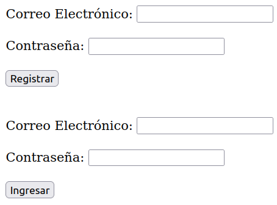

# **Pasos para Configurar y Usar la Aplicación:**

***1. Clonar el Repositorio:*** Clona este repositorio en tu máquina local usando el link:

```
https://github.com/DiegoMartinez2094/Login_react.git
```

***2. Instalar Dependencias:*** Asegúrate de tener Node.js instalado esta app fue diseñada y ejecutada en la version v18.16.1. Luego, ejecuta el siguiente comando para instalar las dependencias:

```
npm install
```

***3. Configurar Variables de Entorno:*** Abre el archivo `.env.example` y verifica las variables de entorno necesarias para la conexión al servidor y a la base de datos en Atlas. Asegúrate de proporcionar los valores correctos para `My_server`, `ATLAS_USER`, `ATLAS_PASSWORD` y `ATLAS_DB`. y quita .example que el nombre del archivo sea solo `.env`

***4.Iniciar archivo:***  Esta aplicación cuenta con dos partes, frontend y backend, para iniciarlas debe ejecutar el inicializador tanto en frontend como en backend en dos terminales diferentes

 **Iniciar el Frontend**: Ejecutamos el archivo frontend mediante el siguiente comando en la terminal:

```
npm run dev
```

Nos dará un mensaje similar a este:

  ➜  Local:   http://localhost:5173/

**Iniciar el backend**: abrimos una terminal aparte de la del frontend sin cerrar la del frontend, escribimos el comando:

```
cd backend
```

luego instalamos las dependencias del backend con el comando :

```
npm install
```

por ultimo corremos el archivo con el comando: 

```
npm run dev
```

nos saldrá el siguiente aviso:

Servidor iniciado en http://127.10.10.10:5000

***5.Visualizació:**  En la terminal del frontend situamos el puntero del mouse sobre http://localhost:5173/ y oprimimos la tecla Ctrl y le damos click



para ingresar, primero debe registrar su correo y contraseña, si se registra con el mismo correo anterior saldrá el siguiente aviso: credenciales registradas anteriormente, si se ingresan credenciales incorrectas saldra el siguiente aviso: credenciales incorrectas
